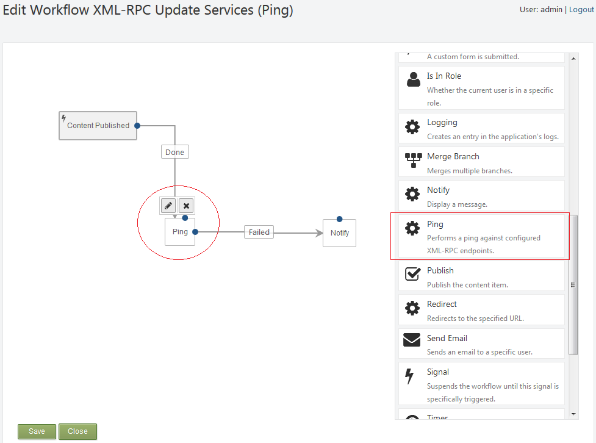
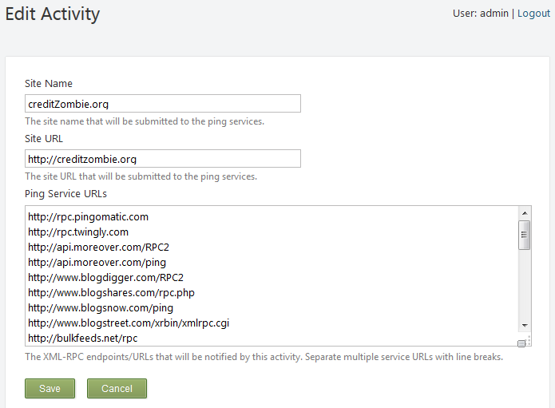

SH.Ping
=======

OrchardCMS XML-RPC Workflow Activity for use when items are created/published that behaves similar to other popular blog and CMS platforms along with the ability to configure custom URLs and some suggested defaults.

Usage:

1. Install the plugin from the package or Orchard Gallery (see Orchard docs for more detail)
2. Enable the plugin, named simply "Ping" from the SEO category
3. Include the new "Ping" activity from any workflow you feel necessary

The following is an example workflow from http://creditzombie.org, in where when content is published we perform a ping to the configured update services and upon failure notify the user publishing the content with a warning as well as include the detailed failure in the Orchard logs. For this example, we're also filtering our Published Content to only specific content types.

Our example workflow, named "XML-RPC Update Services (Ping)" has 3 items on it, our Ping task is in the middle and has 2 possible outcomes, Success and Failed.

When we click the pencil icon on our Ping task to edit the properties, you can see we get the site defaults as configured in the OrchardCMS site settings such as Site Name, Base URL and we also get a default list of Ping services (this is hard-coded in the plugin, sorry guys). You can override any of these, and in this way some workflow activities can ping different information to different services, etc. Any of these fields will retain edits made for only that workflow activity/task (this plugin won't actually update your site settings, so rest easy).

That's it!

This plugin should make a nice addition to any content management system where there are regular updates so you can benefit from the same SEO, linkbuilding and content sharing services XML-RPC Ping protocols have enabled on the web, ones that other blogging and CMS platforms have been using for quite some time now.

Feel free to submit any issues, suggestions, fork, etc.
